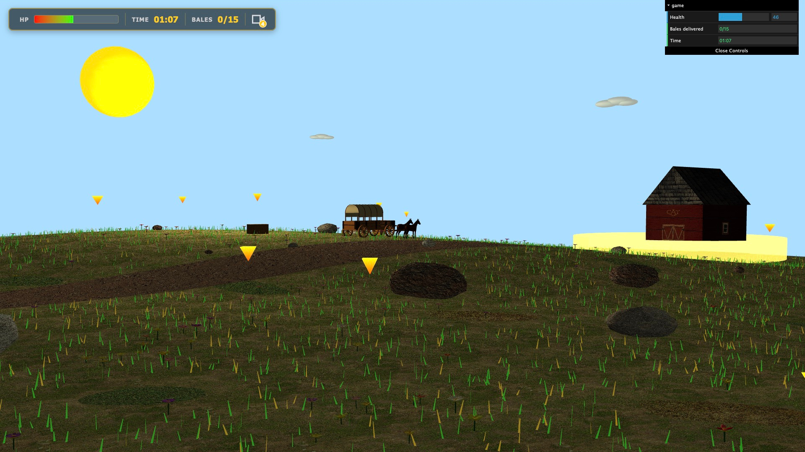
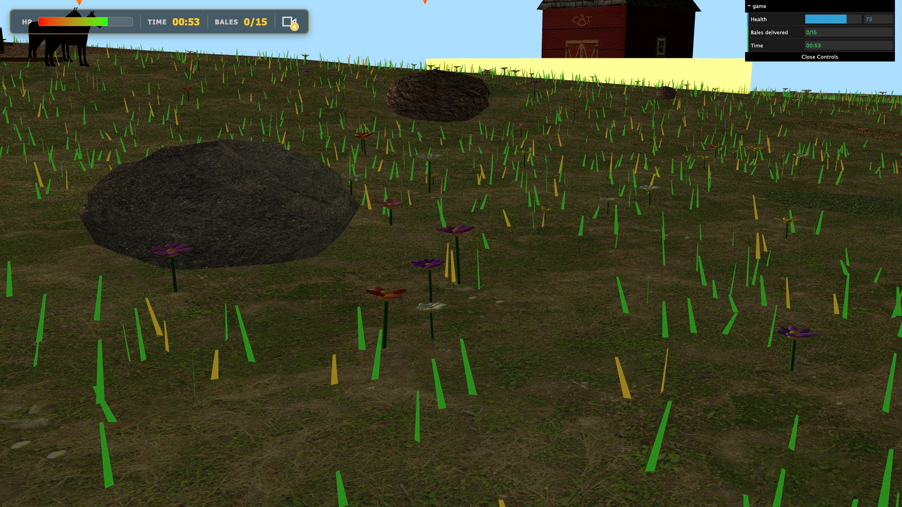
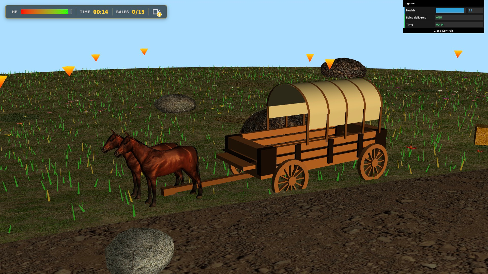
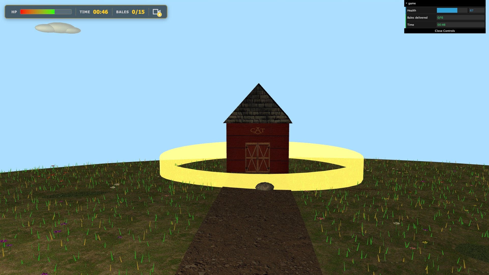

# Spring Prairie Landscape

> Cena 3D interativa em WebGL, ambientada numa pradaria, onde é preciso recolher e entregar fardos de feno com uma carroça antes que a sua saúde chegue ao fim.

## Autores

Grupo T04G03

| Nome                            | E-Mail                   |
| ------------------------------- | ------------------------ |
| Ana Catarina Monteiro de Sousa  | up202306419@edu.fe.up.pt |
| Arthur Pessoa de Mello Teixeira | up202300368@edu.fe.up.pt |
| João Miguel Teixeira da Silva   | up202306429@edu.fe.up.pt |

## Contexto Académico

- **Unidade Curricular:** Computação Gráfica
- **Instituição:** FEUP — Faculdade de Engenharia da Universidade do Porto
- **Ano/Semestre:** 2025/2026 — 2.º semestre
- **Nota obtida:** 16.4/20

## Descrição

A cena baseia-se num cenário de pradaria, onde é possível ver um tapete de relva onde estão presentes algumas flores de diferentes formas e cores que são realçadas pelo sol, presente no céu azul populado por nuvens, que ilumina toda a área. O terreno, além de irregular, tem por si espalhadas várias rochas de vários tipos e tamanhos. Existe ainda um caminho de terra batida, onde se encontra uma carroça puxada por dois cavalos e, já perto do horizonte, um celeiro marcado pela sigla _CAT_.

O objetivo consiste em recolher e entregar no celeiro todos os fardos de feno que estão espalhados pelo cenário, antes que a saúde da carroça chegue ao fim. O jogador tem de ser rápido, visto que, com o passar do tempo, a carroça perde HP. No entanto, é necessário também cuidado na manobra da carroça, pois embater contra as rochas, o celeiro ou a linha de horizonte, origina uma penalização extra na saúde da carroça por cada choque.

### Screenshots

**Vista geral da cena**

**Flores, rochas e terreno**

**Carroça**

**Animação dos shaders**

**Celeiro**

[Ver screenshots das diferentes tags do projeto](screenshots/)

### Vídeo

<video controls src="screenshots/project-t04g03.mp4" title="video"></video>

### Funcionalidades

**Céu, Nuvens e Sol**

- Semiesfera invertida com textura panorâmica de paisagem
- Sol com luz direcional
- Camada de nuvens animada como segunda textura (Bónus: nuvens procedurais e camada animada)

**Terreno e Solo**

- Terreno com elevação suave baseada em height map
- Textura de solo com manchas de terra
- Caminho de terra para a carroça

**Elementos Dispersos**

- Rochas com múltiplas texturas e perturbação de vértices

**Flora**

- Flores paramétricas com aleatoriedade natural (texturas, cores, escala e posicionamento)
- Manchas de erva densa e seca
- Shader de simulação de vento na erva (Bónus: shader de vento)

**Carroça**

- Modelo hierárquico com cobertura de lona, estrado de madeira, timão frontal e 4 rodas
- Cavalos importados em formato OBJ

**Mecânicas da Carroça**

- Controlo por teclado (W/A/S/D)
- Direção das rodas dianteiras
- Recolha (P) e largada (L) de fardos de feno

**Celeiro**

- Estrutura com textura de tábuas de madeira
- Telhado prismático com textura escura
- Texturas de janelas e portas
- Zona circular para entrega com feedback visual (a cor muda ao intersetar)

**Interface**

- Pontos de vida atuais
- Dano por colisão
- Saúde restaurada por entrega de fardos
- Contagem de fardos entregues
- Pontuação (tempo de jogo)

**Animação**

- Rotação de todas as rodas com o avanço da carroça
- Eixo dianteiro orientável solidário com o timão
- Seta indicadora de fardos com movimento vertical animado

**Shaders**

- Shader de vento na erva
- Shader animado para as setas indicadoras de fardos
- Shader para a zona circular de entrega

**Gameplay**

- Sistema de pontos de vida com decaimento temporal
- Recolha e entrega de fardos de feno
- Dano por colisão com rochas e com o celeiro
- Limite de 2 fardos transportados simultaneamente
- Deteção de colisões por distância entre centros
- Fim de jogo com ecrã de vitória/derrota e opção de reinício

**Câmaras**

Sistema de alteração de câmaras (C):

1. **Third Person:** segue a carroça com suavização
2. **First Person:** a partir do lugar do banco da carroça
3. **Top Down:** vista de cima
4. **Manual:** controlo livre com o rato

## Tecnologias Utilizadas

- WebGL / JavaScript
- Shaders customizados (GLSL)
- Modelos OBJ importados
- Height map para geração de terreno

## Requisitos

- Um browser moderno com suporte a WebGL
- Python, Node.js ou VS Code com a extensão Live Server, para servir os ficheiros localmente

## Como Compilar / Executar

Devido ao uso de módulos e texturas, o projeto precisa de ser corrido através de um servidor HTTP local a partir da **raiz do repositório**:

1. **Python:** Executar `python -m http.server` e abrir [http://localhost:8000/project/](http://localhost:8000/project/)
2. **Node.js:** Executar `npx serve` e abrir o link indicado (geralmente [http://localhost:3000/project/](http://localhost:3000/project/))
3. **VS Code:** Usar a extensão **Live Server** no ficheiro `project/index.html`

## Como Usar

| **Tecla** | **Ação**                                     |
| --------- | -------------------------------------------- |
| **W**     | aumentar velocidade                          |
| **S**     | diminuir velocidade                          |
| **A**     | rotação das rodas dianteiras para a esquerda |
| **D**     | rotação das rodas dianteiras para a direita  |
| **P**     | recolher fardo                               |
| **L**     | largar fardo                                 |
| **C**     | trocar de câmara                             |

## Notas Adicionais

**Problemas / Limitações**

- A colisão baseada em distância pode ser imprecisa em rochas de formato muito alongado.
- A performance pode diminuir ligeiramente em sistemas com GPUs integradas devido à densidade da flora (erva).

**Uso de IA**

- Ajuda na adaptação do modo de colisão "OBB-Tree", enunciado aqui: https://graphics.stanford.edu/~jgao/collision-detection.html
- Geração das texturas para a porta, janela e símbolo do celeiro
- Avaliação de Performance/Eficiência
- Organização dos ficheiros
- Ajuda na escolha dos tipos de câmara mais adequados

